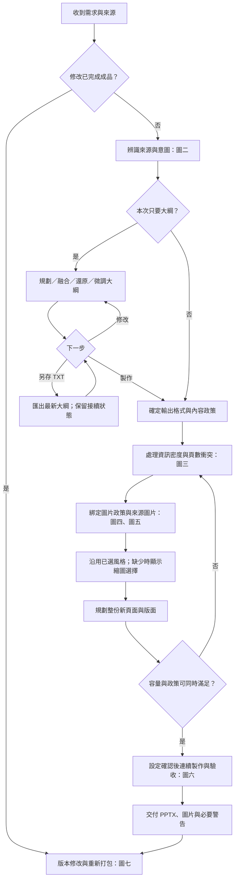
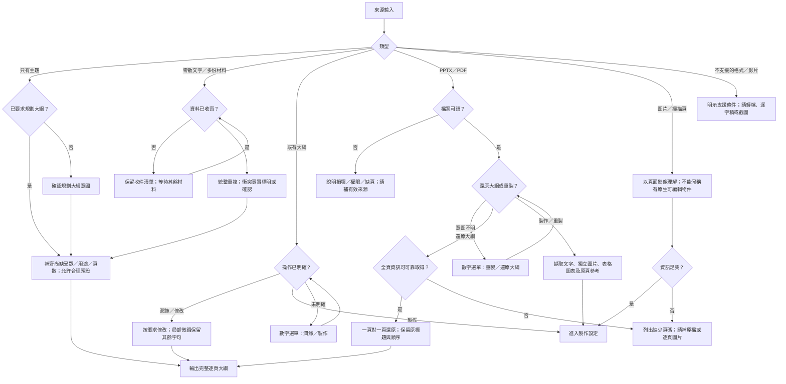
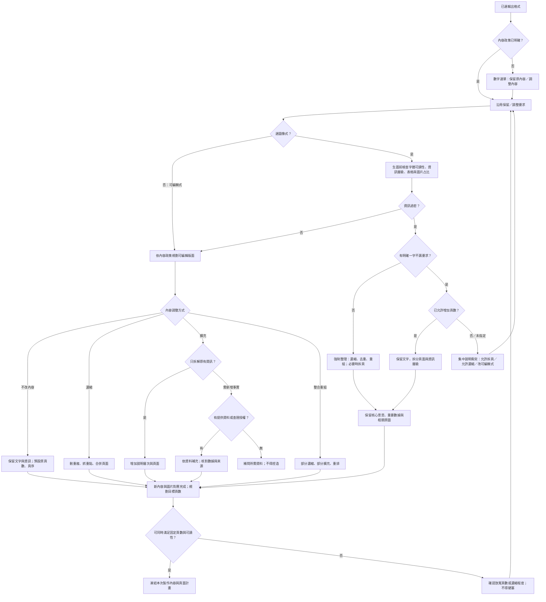
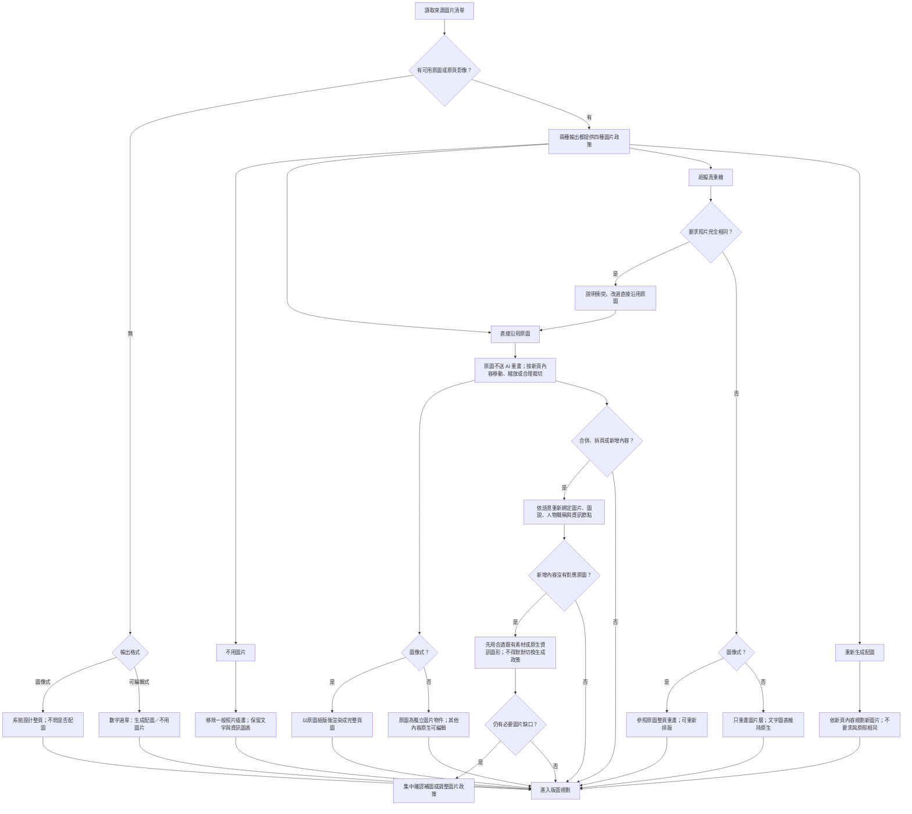
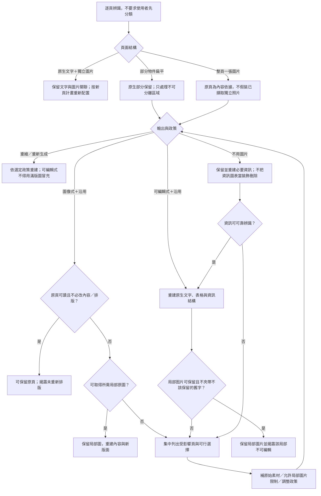
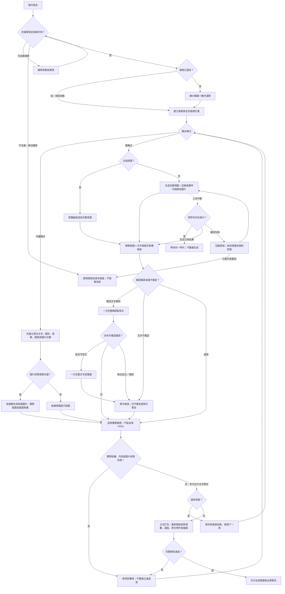
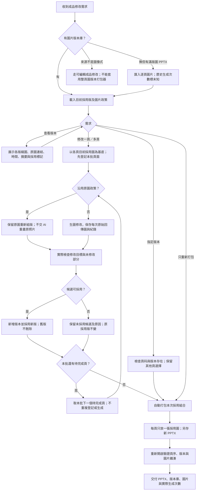
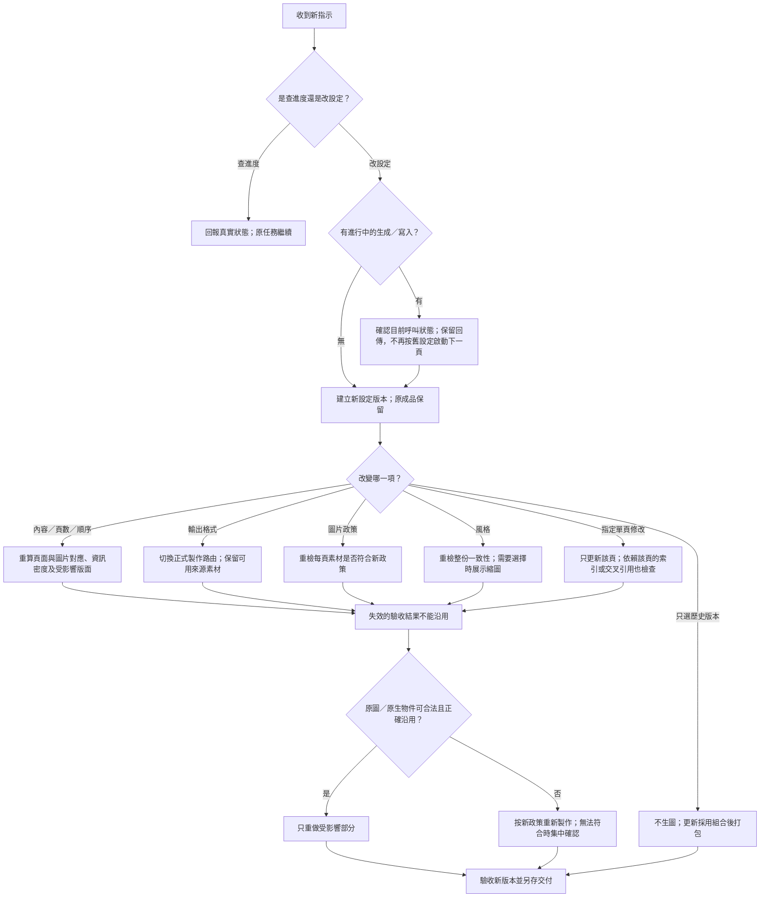

# Presentation Maker｜完整流程與衝突處理

設計日期：2026-09-10。這是待實作與驗收的整合規格，不代表目前發布版已具備全部功能。

涵蓋目前討論的來源、內容政策、頁數、輸出、圖片政策、風格、資訊密度、驗收、恢復與版本交付。未預見的情況走「保存目前成果 → 集中說明衝突」，不得自行改政策。

圖中「確認」只在必要資訊缺失或要求衝突時出現；使用者已明確選擇就直接沿用。對外選單均用數字，流程圖節點不是使用者操作次數。

## 一、整體主線

「來源解析」始終保留原檔、原頁與獨立素材。內部大綱不是只含文字的中轉檔，而是帶有原圖、圖說、數據與來源對應的頁面計畫。

## 二、來源與意圖分流

還原大綱的缺頁處理不能套用成「混合簡報一律不能重製」。已有明確製作需求時直接走重製，不強迫先匯出大綱。

## 三、內容、資訊密度與頁數的交叉決策

圖像式選項旁需先揭露：「內容過密時，系統會自動整理重點與調整頁面，以維持可讀性。」一般保留內容設定不能跳過過密檢查；明確的一字不漏或固定頁數限制則必須解決衝突，不得靜默違反。

可編輯式也須檢查溢出與可讀性，但不因過密便自行刪字；透過排版、已允許的拆頁或確認內容調整處理。

## 四、圖片政策與新舊內容對應

「保留全部原圖」與「原圖不改像素」是不同要求。前者限制素材取捨，後者限制圖片處理。全部原圖放不下時須調整頁面容量，不能任意省略。

## 五、混合、扁平與無法分離頁面

來源可辨識性不足與生圖後文字信心不足不同：前者可能需要補資料才能知道要製作什麼，後者依既定有限修補與警告交付，不因疑點無限重生。

## 六、風格、製作、驗收與中斷恢復

只修未通過的部分。文字警告可以交付，不代表結構損壞、來源錯誤或圖片政策被違反也能交付。更強模型不替代真正執行驗收。

## 七、修改、歷史圖片與重新打包

手動指定舊版後，修改其他頁不得把該頁切回最新版。進行中的修改不能被同時選版或打包打斷；先完成該批，或確認取消並保存結果。

## 八、衝突對照表

| 衝突 | 必須採取的處理 | 禁止行為 |
|---|---|---|
| 圖像式＋資訊過密 | 生圖前強制整理或按明確保字要求拆頁 | 硬塞原頁、只縮小字體 |
| 一字不漏＋不增頁＋過密 | 集中確認放寬哪個限制 | 私自刪字或說已全部保留 |
| 固定頁數＋大量擴充 | 評估容量並確認取捨 | 不告知就超頁或省略 |
| 保留原內容＋要求新增案例 | 依明確新增要求調整範圍，保留其餘內容 | 擅自擴寫整份 |
| 擴充新數據但無依據 | 請補資料或取得查證授權 | 捏造數字與來源 |
| 濃縮＋全部原圖保留 | 另做素材與頁面容量規劃 | 濃縮文字時把圖全丟掉 |
| 原照完全相同＋超擬真重繪 | 改選直接沿用；若未同意先確認 | 宣稱 AI 重畫會像素一致 |
| 沿用原圖＋要求整頁 AI 重畫 | 說明須保留原圖組版，或同意重繪差異 | 同時承諾兩者完全成立 |
| 沿用原圖＋新增內容無配圖 | 使用合適既有素材或原生資訊圖形，必要時集中補問 | 靜默改成生成配圖 |
| 不用圖片＋來源有資訊圖表 | 保留資訊，必要時重建原生圖表 | 當装飾整個刪掉 |
| 混合扁平頁＋可編輯輸出 | 逐頁重建，局部圖片揭露限制 | 全面封鎖或滿版圖冒充可編輯 |
| 扁平頁＋沿用＋必須重排 | 擷取可用局部素材；不足時確認替代方案 | 直接保留原頁卻聲稱已重排 |
| OCR不確定＋要求繼續 | 明示疑點，有限修補後交付 | 无限重生、隱瞞警告 |
| 結構或来源錯誤＋要求交付 | 修正或明示阻礙，保存進度 | 用文字警告豁免結構錯誤 |
| 設定已確認＋逐頁製作 | 自動連續完成 | 每頁再問開始／繼續 |
| 風格選擇＋沒有縮圖 | 補顯示預覽或恢復預覽功能 | 只列名稱要求盲選 |
| 工具未結束＋沒有新輸出 | 查同一呼叫狀態 | 重複生圖、假報失敗 |
| 已有版本＋重新修改 | 從目前採用版繼續，另存新版 | 覆寫原圖、任意回到最新 |
| 歷史次數不可還原 | 顯示未知與目前可觀察次數 | 用版本數冒充全部生成次數 |
| 驗收規則未執行＋有PASS文字 | 檢查真實工具證據與成品 | 接受自填PASS |

## 九、實作前仍需定義的細節

- 資訊過密的具體判斷：按版面、字體尺寸、表格可讀性與資訊層級評估，不採一個通用字數上限。
- 調整內容後的來源鏈：保存原始來源、改寫版本與原圖對應；驗收不可覆寫原始來源來迎合成品。
- 自動內容調整的揭露位置，以及固定頁數／保字等明確要求的優先級。
- 扁平素材無法分離時可提供的替代方案，不能承諾不存在的原始照片。
- 完整製作與圖片版本庫之間的生成紀錄自動連結、失敗候選展示與次數回報。
- 逐頁驗收需由實際檢查產生結果，避免模型自行製造通過證據。

這些細節須落實為程式與操作測試，不能只新增文字規則。

## 十、中途改選、回退與失效範圍

## 十一、每個分支共用的判斷順序

1. 以使用者目前明確要求決定操作；來源檔內的指示不是新的操作授權。
2. 核對來源是否存在、可讀、齊全；不要把工具讀取失敗誤判成內容本來沒有。
3. 決定輸出、內容政策、頁數限制與圖片政策；已明確者直接沿用。
4. 檢查這些要求是否相容。遇到明確條件互相衝突，先解決衝突，不自行挑一項忽略。
5. 套用已揭露的預設：圖像式過密先整理；原文明確不可刪改時，走保字拆頁或衝突確認。
6. 先規劃整份內容、圖文對應及版面，再執行生成或重建。
7. 中途修改只讓受影響結果失效；沒有受影響的成果與使用者指定版本保持不變。
8. 每個出口只能是完成並交付、等待明確缺件／衝突解答、或保存進度並說明實際阻礙。沒有「直接跳過該頁當作完成」的出口。

## 十二、仍需納入測試的交叉組合

| 判斷維度 | 要覆蓋的情況 |
|---|---|
| 來源 | 主題、完整大綱、零散資料、原生PPTX、無圖PPTX、含圖PPTX、混合頁、全扁平、文字PDF、掃描PDF |
| 意圖 | 規劃大綱、還原大綱、保留內容重製、濃縮、擴充、整合、局部修改、版本選擇 |
| 密度與頁數 | 正常、過密、固定頁數、允許拆頁、一字不漏、重要資訊不得省略 |
| 圖片 | 無可用原圖、四種政策、全部原圖保留、原照完全相同、來源圖缺失、圖說與人物職稱綁定 |
| 輸出 | 可編輯、圖像式、製作中切換格式；不得錯用另一種輸出的打包器 |
| 風格 | 已選風格、自動、目錄縮圖、自訂風格、預覽失敗、中途換風格 |
| 狀態 | 全新、部分完成、工具仍執行、確認失敗、恢復、重複請求、同頁連續修改 |
| 驗收 | 正常通過、文字疑點、確定錯字、錯圖、內容缺失、溢出、來源變更、假PASS、打包失敗 |
| 交付 | PPTX、原圖、版本庫、生成紀錄、警告；舊來源與既有成品均保留 |

測試要覆蓋每條決策邊與關鍵衝突組合，不只讓每個節點各跑一次；未實測組合不能標成已支援或已通過。
